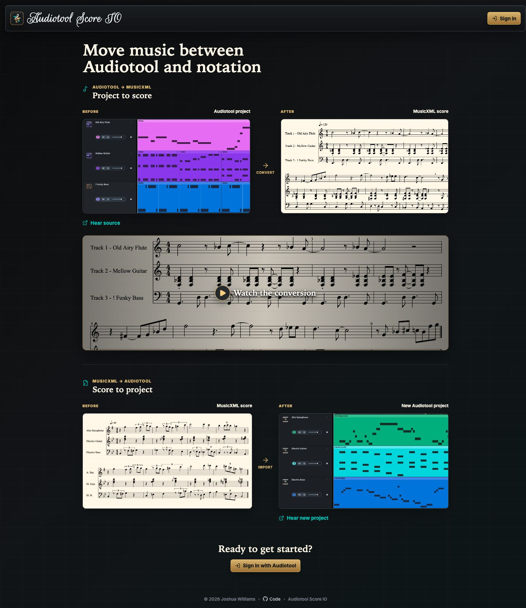

# Audiotool Score IO

Audiotool Score IO turns editable [Audiotool](https://www.audiotool.com/) note tracks into notation-friendly MusicXML and imports MusicXML scores into new Audiotool projects. It is designed for musicians who want to move compositions between a browser-based DAW and notation software without manually rebuilding every part.

The public sign-in page includes examples of both conversion directions—a short project-to-notation recording and a rendered MusicXML score with links to the corresponding Audiotool tracks—so visitors can understand the workflow before connecting an account.



The interesting work happens between those formats. Audiotool timing is rendered to MIDI, evaluated against multiple ordinary and triplet grids, cleaned with an executable rhythm grammar, and written directly as MusicXML. The reverse flow parses MusicXML and compressed MXL directly, preserves the supported musical structure, and creates editable Audiotool note tracks.

The project is a full-stack TypeScript monorepo rather than a wrapper around a desktop notation program. Its conversion packages are reusable independently of the React app and Express API, while the production containers remain Node-only.

## Production Deployment

The web app is deployed at [audiotool-score-io.pages.dev](https://audiotool-score-io.pages.dev/), with the static React frontend on Cloudflare Pages and the conversion API on Google Cloud Run.

The current Pages build targets the deployed Cloud Run API, and both production health endpoints are responding. Direct production smoke tests have also passed for CORS, MIDI conversion, and MusicXML/MXL import. The authenticated browser workflow still needs a final owner-run check with real Audiotool projects.

Audiotool OAuth is required to list, inspect, export, or create projects, so visitors need an Audiotool account for the converter itself. The public before/after examples and recording remain available without signing in.

## Project Highlights

- Full-stack TypeScript across a React/Vite frontend, Express API, and three reusable conversion packages.
- Audiotool OAuth and API integration for project discovery, note-track inspection, export, and creation.
- Direct MIDI quantization and MusicXML generation with rhythm spelling, ties, rests, beams, triplets, compound and odd meters, clefs, and octave shifts.
- Direct `.musicxml`, `.xml`, and compressed `.mxl` parsing without a MIDI round trip.
- Multi-stage, Node-only Docker images deployed to Cloud Run, with a Cloudflare Pages frontend and automatic Artifact Registry cleanup.
- Keyboard-oriented interaction design, visible focus states, semantic controls, roving focus for tab/radio groups, and a score-preview text alternative.
- Production runbooks for health checks, CORS verification, synthetic conversion smoke tests, cost controls, and rollback.

## How It Works

### Audiotool to MusicXML

1. Sign in with Audiotool and choose one of your projects.
2. Select its editable note tracks, adjust the score and part names, and choose a score, separate parts, or both.
3. The API renders the selected tracks to MIDI, automatically chooses a canonical timing grid, and writes MusicXML directly.
4. Preview the score in the browser and download the MusicXML files or zip archive.

### MusicXML to Audiotool

1. Choose a `.musicxml`, `.xml`, or `.mxl` score.
2. Review the detected parts, select what to import, and edit the new project and track names.
3. The API parses the score and creates a new Audiotool project with one editable note track per selected part.
4. Unsupported notation details are summarized as warnings instead of being silently treated as editable Audiotool data.

The API also accepts an uploaded MIDI file for direct MIDI-to-MusicXML conversion without an Audiotool project.

## Architecture

- [`apps/web`](apps/web/) is the accessible React/Vite browser interface and score viewer.
- [`apps/api`](apps/api/) is the Express API that composes the conversion packages.
- [`packages/audiotool-to-midi`](packages/audiotool-to-midi/) inspects Audiotool projects and renders selected note tracks to MIDI.
- [`packages/midi-to-musicxml`](packages/midi-to-musicxml/) owns multi-grid quantization, notation cleanup, and direct MusicXML generation.
- [`packages/score-to-audiotool`](packages/score-to-audiotool/) parses MusicXML/MXL and creates Audiotool projects and note tracks.
- [`experiments/notation-ranker`](experiments/notation-ranker/) evaluates notation candidates and an eventual learned ranker against the current heuristic approach.

See [`docs/CODEMAP.md`](docs/CODEMAP.md) for a file-by-file navigation guide and [`docs/RHYTHM.md`](docs/RHYTHM.md) for the notation pipeline's design principles.

## Engineering Tradeoffs

- **Direct notation generation:** keeping conversion in TypeScript removes the runtime size, startup cost, and operational complexity of a desktop notation engine. It also means engraving behavior must be implemented and regression-tested explicitly; key-aware enharmonic spelling and arbitrary tuplets remain future work.
- **Cloud Run plus Cloudflare Pages:** the split keeps static delivery inexpensive and lets the API scale to zero. In return, production needs explicit cross-origin configuration, two coordinated deployments, and tolerance for Cloud Run cold starts.
- **Focused import fidelity:** the importer preserves supported notes, chords, ties, transposition, timing, tempo, and meter while warning about unsupported notation. Richer voice/staff separation, percussion mapping, later tempo/meter changes, and instrument selection are deliberately left for future iterations.

## Run locally

Requires Node.js 22 or newer. The Audiotool SDK uses modern Promise APIs that are not available in Node 20.

1. Install dependencies:

   ```bash
   npm install
   ```

2. Optionally create a local environment file:

   ```bash
   cp .env.example .env
   ```

3. Register an Audiotool application at `https://developer.audiotool.com/applications`.

   For Vite dev, add this redirect URI to the Audiotool application:

   ```text
   http://127.0.0.1:5173/
   ```

   Then set `VITE_AUDIOTOOL_CLIENT_ID` in `.env`. The client ID is safe to expose in the browser.
   Audiotool browser sign-in uses Web Crypto for OAuth. Open the app through `http://127.0.0.1:5173/`,
   `http://localhost:5173/`, or HTTPS; browser sign-in can fail on insecure LAN or `0.0.0.0` origins.

4. Start the server. This builds the TypeScript packages before launching the API:

   ```bash
   npm run start:api
   ```

5. Start the web app:

   ```bash
   npm run dev
   ```

   Open `http://127.0.0.1:5173/`. The root route redirects to `/sign-in` or `/app` based on the
   Audiotool auth state; `/app` is the protected converter workspace. The Vite dev server proxies API
   requests to `http://127.0.0.1:3000`.
   CSS changes hot reload through Vite. If the Docker web container is already using port `5173`,
   stop it with `docker compose stop web` or run Vite on another port:

   ```bash
   npm run dev -- --port 5174
   ```

6. Send a `POST` request to `/convert` with a `multipart/form-data` field named `file`.

   Example using `curl`:

   ```bash
   curl -F "file=@song.mid" "http://localhost:3000/convert" --output song.musicxml
   ```

Check runtime readiness:

```bash
curl http://localhost:3000/ready
```

### Quantization options

Set `?quantize=false` to bypass MIDI timing quantization altogether.

When quantization is enabled, the shared multi-grid quantizer produces canonical MIDI before direct MusicXML generation. It evaluates several ordinary and triplet grids automatically.

Consistently extreme high or low parts use whole-part octave clefs automatically: treble 8va/15ma for high parts and bass 8vb/15mb for low parts. Set `octaveClefs: 'off'` in the package API to keep ordinary treble/bass clefs plus measure-local octave-shift directions only.

The package also exports `quantizeMidiForNotation` and `quantizeMidiBytesForNotation` for callers that want the canonical MIDI directly.

The package API exposes the same choice:

```js
await convertMidiToMusicXml({
  inputPath: 'song.mid',
  octaveClefs: 'auto',
  outputPath: 'song.musicxml'
});
```

## Audiotool to MIDI

`@midi-to-xml/audiotool-to-midi` exports Audiotool note tracks as standard MIDI. It keeps the Audiotool track entity ID as the stable key, while using track order and player display name for labels. The web app lets users edit the score title and each track's export title before conversion; blank edits fall back to the detected project or track label.

Core helpers:

```js
import {
  createAudiotoolSession,
  getAudiotoolProjectDetails,
  inspectAudiotoolProject,
  openAudiotoolProject,
  exportAudiotoolProjectToMidi
} from '@midi-to-xml/audiotool-to-midi';

const client = await createAudiotoolSession({ pat: process.env.AUDIOTOOL_PAT });
const details = await getAudiotoolProjectDetails(client, projectUrl);
const project = await openAudiotoolProject(client, details.reference.projectUrl);
const manifest = inspectAudiotoolProject(project);

const result = await exportAudiotoolProjectToMidi(project, {
  tracks: [manifest.tracks[0].id],
  mode: 'both',
  title: 'Project Sonata',
  trackTitles: {
    [manifest.tracks[0].id]: 'Clarinet Melody'
  }
});
```

Supported MIDI output modes are:

- `combined`: one MIDI file with one track per selected Audiotool note track.
- `separate`: one MIDI file per selected Audiotool note track.
- `both`: a combined MIDI file plus the separate part files.

The exporter handles note regions, collection offsets, looping regions, disabled tracks/regions, and slide-note warnings. Audio/sample tracks are intentionally out of scope for this package because they require transcription rather than direct MIDI extraction.

Project references can be a full Audiotool Studio URL, a UUID, or a `projects/{project_id}` resource name. Full URLs are useful for the site flow because the app can fetch project details first, show the user what they selected, and then open the project for track inspection/export.

### Audiotool API flow

The web app uses Audiotool browser OAuth through `@audiotool/nexus`, exports the user's access/refresh token data, and sends those tokens to the API for server-side conversion. For scripts or server-only demos, set `AUDIOTOOL_PAT` in `.env`, or send a bearer token in the request.

Fetch project details without opening the full DAW document:

List accessible projects:

```bash
curl -X POST http://localhost:3000/audiotool/projects \
  -H "Content-Type: application/json" \
  -d '{"pageSize":25}'
```

```bash
curl -X POST http://localhost:3000/audiotool/project \
  -H "Content-Type: application/json" \
  -d '{"project":"https://beta.audiotool.com/studio?project=<project-id>"}'
```

Inspect exportable note tracks:

```bash
curl -X POST http://localhost:3000/audiotool/inspect \
  -H "Content-Type: application/json" \
  -d '{"project":"https://beta.audiotool.com/studio?project=<project-id>"}'
```

Convert selected Audiotool tracks all the way to MusicXML. Optional `title` and `trackTitles` values override the exported score title and selected track/part names:

```bash
curl -X POST "http://localhost:3000/audiotool/convert" \
  -H "Content-Type: application/json" \
  -d '{"project":"https://beta.audiotool.com/studio?project=<project-id>","tracks":["<track-id>"],"mode":"score","title":"Project Sonata","trackTitles":{"<track-id>":"Clarinet Melody"}}' \
  --output audiotool.musicxml
```

Use `"mode":"parts"` for one MusicXML file per selected track, or `"mode":"both"` for a zip containing the full score and parts.

The direct converter applies an executable rhythm grammar to canonical MIDI, with approved notation rules for ordinary and dotted values, ties, rests, staccato cleanup, beams, triplets, compound meters, odd-meter fallback grouping, and 2/2-as-4/4 spelling. Key selection, contextual enharmonic respelling, and arbitrary quintuplet/septuplet candidate generation are not implemented yet. Output currently declares C major and uses the fixed black-key spellings C-sharp, E-flat, F-sharp, A-flat, and B-flat.

## MusicXML to Audiotool

The authenticated web app also has a `MusicXML -> Audiotool` workflow. Choose a `.musicxml`, `.xml`, or `.mxl` score to analyze its parts automatically, choose which parts to import, edit the Audiotool project and track names, and create the project.

The importer reads MusicXML directly with lightweight Node libraries, including compressed `.mxl` files. It maps selected score parts to one Audiotool note track each, using basic Gakki instruments and mixer channels. It imports pitched notes and chords, ties, written-to-sounding transposition, timing expressed through MusicXML voices/backup/forward events, the first tempo, and the first time signature. When present, notation-only details such as slurs, dynamics, articulations, lyrics, repeats, grace notes, separate voice assignment, and percussion notation are reported as warnings and are not preserved yet.

Analyze an upload without creating a project:

```bash
curl -X POST http://localhost:3000/audiotool/import \
  -F "dryRun=true" \
  -F "file=@score.musicxml"
```

Create a new Audiotool project from selected parts:

```bash
curl -X POST http://localhost:3000/audiotool/import \
  -F 'audiotoolAuth={"accessToken":"...","refreshToken":"...","expiresAt":1893456000000,"clientId":"..."}' \
  -F "title=Imported Score" \
  -F 'parts=["part-1","part-2"]' \
  -F 'partTitles={"part-1":"Violin","part-2":"Cello"}' \
  -F "file=@score.musicxml"
```

For scripts, you can use an `Authorization: Bearer <PAT>` header or set `AUDIOTOOL_PAT`, the same as the existing Audiotool export endpoints.

## Runtime configuration

MIDI conversion and MusicXML import run entirely in Node. No desktop notation executable, virtual display, or Python runtime is required.

Useful environment variables:

- `MAX_UPLOAD_BYTES=52428800` controls the upload limit. Default: 50 MB.
- `JSON_BODY_LIMIT=1mb` controls JSON request size. Default: 1 MB.
- `VITE_AUDIOTOOL_CLIENT_ID` enables browser OAuth login for the web app.
- `VITE_AUDIOTOOL_REDIRECT_URL` overrides the OAuth redirect URL. Leave blank to use the browser's current origin.
- `VITE_AUDIOTOOL_SCOPE=project:write` controls requested Audiotool OAuth scopes. The browser app opens/syncs projects through Nexus, which currently requires `project:write`.
- `AUDIOTOOL_CLIENT_ID` optionally provides an API-side client ID fallback for browser-exported OAuth tokens.
- `AUDIOTOOL_PAT` optionally provides server-side Audiotool auth for the Audiotool API routes.

## Docker

Start a local Docker dev environment with Vite hot reload:

```bash
npm run docker:dev
```

Open `http://127.0.0.1:5173/`. The root route redirects to `/sign-in` or protected `/app` based on
auth state. The web service runs Vite in a Node container,
mounts the local source tree, and proxies API requests to the Compose `api`
service. Web changes hot reload on save. API and shared-package TypeScript
changes automatically restart the API process, so neither development container
needs to be rebuilt or restarted for ordinary source edits.

Stop the Docker dev environment:

```bash
npm run docker:dev:down
```

If dependencies change, rebuild the dev images and recreate the dependency volumes:

```bash
docker compose -f compose.dev.yml down -v
npm run docker:dev
```

Start the production-style API and static web app together:

```bash
docker compose up --build
```

Register `http://127.0.0.1:5173/` as an Audiotool redirect URI, set `VITE_AUDIOTOOL_CLIENT_ID` in `.env`, then open `http://127.0.0.1:5173/`. The web container serves the React app, supports direct refreshes on `/sign-in` and `/app`, and proxies `/audiotool`, `/convert`, `/health`, and `/ready` to the API container.

Optional host port overrides:

```bash
API_PORT=3100 WEB_PORT=8180 docker compose up --build
```

Compose reads values from `.env` for settings such as `AUDIOTOOL_PAT` and upload limits. The API container is a Node-only image.

Stop both containers:

```bash
docker compose down
```

### Cloud Run + Cloudflare Pages deployment details

The recommended production setup puts the lightweight Node API on Cloud Run and the static React app on Cloudflare Pages. See [`docs/deployment/cloud-run.md`](docs/deployment/cloud-run.md) for the ownership checklist, exact Cloudflare build settings, one-command API deployment, automatic Artifact Registry image cleanup, verification, and rollback steps.

### API-only image

Build the image:

```bash
docker build -t midi-to-musicxml .
```

Run the container:

```bash
docker run --rm -p 3000:3000 midi-to-musicxml
```

Or pass a local environment file:

```bash
docker run --rm --env-file .env -p 3000:3000 midi-to-musicxml
```

Then upload MIDI to `http://localhost:3000/convert`.
